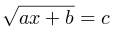

Решите в целых числах уравнение:

,

a, b, c – данные целые числа: найдите все решения или сообщите, что решений в целых числах нет.

Формат ввода
Вводятся три числа a, b и c по одному в строке.

Формат вывода
Программа должна вывести все решения уравнения в порядке возрастания, либо NO SOLUTION (заглавными буквами), если решений нет. Если решений бесконечно много, вывести MANY SOLUTIONS.

Пример 1
Ввод	Вывод
1
0
0
0
Пример 2
Ввод	Вывод
1
2
3
7
Пример 3
Ввод	Вывод
1
2
-3
NO SOLUTION